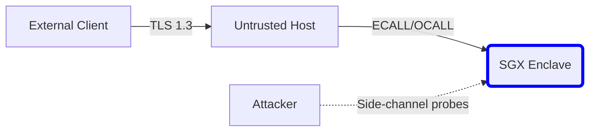
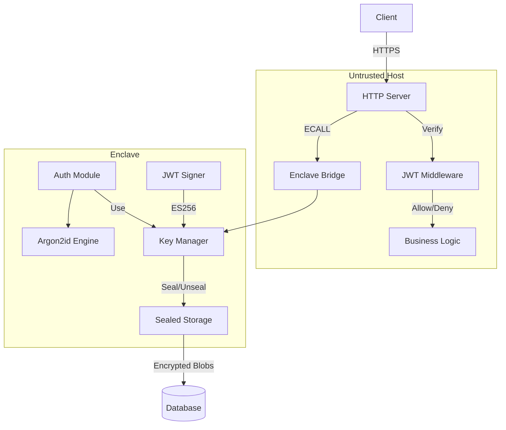
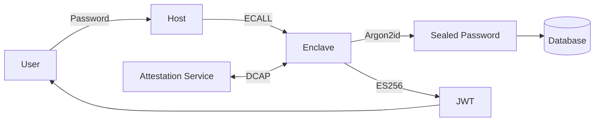
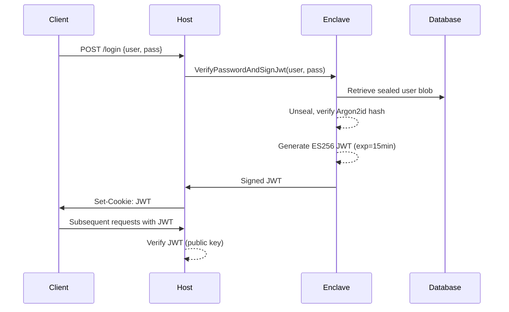

## Executive Summary

This document details the architecture of our SGX-enclave-based authentication microservice, which securely handles user credentials and JWT issuance within a hardware-protected Trusted Execution Environment (TEE). The enclave generates and seals an ECDSA P-256 key pair at initialization, ensuring private keys never leave the enclave. User password hashes (Argon2id) are sealed per-user and persisted externally. The solution provides defense-in-depth against host compromise, implements remote attestation via Intel DCAP, and uses ES256 JWTs for stateless authentication. Performance-critical paths are optimized with batched ECALLs.

## Threat Model & Assumptions

### Attacker Capabilities:
- **Compromised host OS**: Full control over non-enclave processes
- **Physical access**: Memory bus snooping, cold boot attacks
- **Network attackers**: Eavesdropping, replay, MITM
- **Malicious tenants**: Attempting privilege escalation

### Trust Boundaries:


### Assumptions:
1. Intel SGX hardware is genuine and not compromised
2. Enclave code is audited and free of critical vulnerabilities
3. Remote attestation service is trusted
4. Sealing root is securely backed up
5. Physical attacks require TCB reset

## Detailed Architecture

### Component Diagram


### Data-Flow Diagram


## Sequence Diagram: Login & Token Issuance


## Key Management

### Lifecycle:
1. **Generation** (at enclave init):
   ```cpp
   sgx_ecc_state_handle_t ctx;
   sgx_ecc256_create_key_pair(&private_key, &public_key, &ctx);
   ```
2. **Sealing**:
   ```cpp
   sgx_get_seal_key(SGX_KEYPOLICY_MRENCLAVE, &key_policy, &cpu_svn, &seal_key);
   sgx_rijndael128GCM_encrypt(...); // AES-GCM seal private key
   ```
3. **Storage**: Sealed blob in DB (AES-GCM-256)
4. **Rotation**:
   - Automated quarterly via attested rekey ECALL
   - Emergency rotation via admin CLI (requires attestation)
5. **JWKS Exposure**:
   ```bash
   GET /.well-known/jwks.json
   {"keys": [{"kty":"EC","crv":"P-256","x":"...","y":"...","use":"sig"}]}
   ```

### Fallback Plan:
- HSMs hold offline backup of sealing root key
- Manual recovery mode with 3-admin quorum

## User Registration & Login Flows

### Registration:
```cpp
// ECALL: RegisterUser(const char* user, const char* pass)
sgx_status_t ecall_register(...) {
    uint8_t salt[16] = secure_random();
    argon2id_hash(pass, salt, &pwd_hash); // 1.5s params
    sgx_seal_data(..., &sealed_blob);
    host_persist_blob(user, sealed_blob); // OCALL
}
```

### Login & JWT:
```cpp
// ECALL: VerifyPasswordAndSignJwt(...)
if (!argon2id_verify(pass, unsealed_hash)) 
    return SGX_ERROR_INVALID_PARAMETER;

jwt::signer signer(es256_private_key);
signer.set_issued_at(now).set_expiration(now+900);
return signer.sign(claims);
```

### Host Verification (Node.js):
```js
const middleware = (req, res, next) => {
    const token = req.cookies.jwt;
    jwt.verify(token, publicKey, {algorithms: ['ES256']}, (err, decoded) => {
        if (err) return res.sendStatus(403);
        req.user = decoded;
        next();
    });
};
```

## Remote Attestation Walkthrough (DCAP)

### Steps:
1. Enclave generates quote:
   ```cpp
   sgx_report_t report;
   sgx_create_report(&target_info, &report_data, &report);
   sgx_get_quote(&report, SGX_UNLINKABLE_SIGNATURE, &p_quote);
   ```
2. Quote structure:
   ```json
   {
     "version": 4,
     "sign_type": "ECDSA_P256",
     "qe_svn": 7,
     "pce_svn": 11,
     "report_data": "0x...",
     "mr_enclave": "0x...",
     "mr_signer": "0x..."
   }
   ```
3. Verification service checks:
   - Quote signature validity
   - TCB status via PCCS
   - MR_ENCLAVE against golden image
   - Policy compliance

## Performance Considerations

### ECALL Costs:
| Operation | Latency (μs) | Mitigation |
|-----------|--------------|------------|
| ECALL entry | ~8,000 | Batch operations |
| ECDSA keygen | 120,000 | Generate at init |
| Argon2id (1.5s) | 1,500,000 | Parallelize host requests |
| JWT sign | 1,200 | Use efficient libraries |

### Optimizations:
- Precompute JWTs for frequent users (with expiry guard)
- Connection pooling for DB access
- ECALL batching for bulk operations
- AES-GCM sealing offloaded to ISA-L

## Security Hardening Checklist

- [ ] **Side-channel mitigation**:
  - Constant-time Argon2id and ECDSA
  - ORAM for enclave memory access patterns
- [ ] **Compiler flags**:
  ```cmake
  add_compile_options(-m64 -fstack-protector-strong -fpic -fPIE -Werror)
  ```
- [ ] **Runtime protections**:
  - Enclave page permissions (R/W/X separation)
  - Canary guards for stack corruption
- [ ] **Cryptographic hygiene**:
  - Zeroize sensitive memory after use
  - Reject short passwords (min 12 chars)
- [ ] **PFS for admin channels**:
  ```TLS_ECDHE_RSA_WITH_AES_256_GCM_SHA384```

## Token Lifecycle & Revocation

### Lifecycle Controls:
| Phase | Duration | Mechanism |
|-------|----------|-----------|
| Issuance | 15 min | JWT `exp` claim |
| Renewal | Client-side silent auth | Refresh token (separate enclave ECALL) |
| Revocation | Immediate | Public key rotation (JWKS) |

### Key Rollover:
1. Generate new key pair in enclave
2. Add to JWKS (keeping old key)
3. Wait 2x max token lifetime (30 min)
4. Remove old key from JWKS
5. Re-seal new private key

## Glossary

| Term | Definition |
|------|------------|
| EPC | Enclave Page Cache (secure memory) |
| ECALL | Entry into enclave from untrusted code |
| OCALL | Exit from enclave to host |
| Sealing | Encrypting data with enclave-bound key |
| DCAP | Data Center Attestation Primitives |
| JWKS | JSON Web Key Set (public keys) |
| TCB | Trusted Computing Base |

## Further Reading & References

1. [Intel SGX Developer Guide](https://software.intel.com/sgx)
2. RFC 7519: JSON Web Tokens (JWT)
3. Argon2 RFC: [draft-irtf-cfrg-argon2-13](https://datatracker.ietf.org/doc/draft-irtf-cfrg-argon2/)
4. [mbedTLS Security Considerations](https://mbed-tls.readthedocs.io/en/latest/kb/cryptographic-security/)
5. DCAP Attestation: [Intel Architecture Guide](https://download.01.org/intel-sgx/dcap-1.0/docs/SGX_ECDSA_QuoteGenReference_DCAP_API_Linux_1.0.pdf)
