# Secure Wallet Signer Architecture  
**Combining Intel SGX and WebAuthn for High-Assurance Transaction Signing**

## System Components
| Component       | Technology Stack          | Responsibilities                                                                 |
|-----------------|---------------------------|----------------------------------------------------------------------------------|
| **Frontend**    | WebAuthn API (React/JS)   | Passkey registration/authentication, transaction initiation, challenge handling |
| **Backend**     | Rust/Python (SGX SDK)     | Enclave management, request routing, challenge indexing, audit logging          |
| **Enclave**     | Intel SGX (Rust/C++)      | Key generation/sealing, WebAuthn challenge signing/verification, transaction signing |

---

## Lifecycle

### 1. Account Creation

```mermaid
sequenceDiagram
    participant FE  as Frontend
    participant BE  as Backend
    participant AU  as Authenticator
    participant ENC as SGX Enclave

    FE->>BE: /passkey-reg-options (userId)
    BE-->>FE: WebAuthn **create()** options
    FE->>AU: navigator.credentials.create(options)
    AU-->>FE: attestation (credId, pubKey)
    FE->>BE: /passkey-register {attestation}
    BE->>BE: Verify attestation \n& store **userPubKey** in DB

    FE->>BE: /create_account request
    BE->>ENC: requestChallenge(userPubKey)
    ENC-->>BE: **challenge** (bound to key-index)
    BE-->>FE: WebAuthn **get()** options \n(with SGX challenge)
    FE->>AU: navigator.credentials.get(options)
    AU-->>FE: assertion (signature, authData)
    FE->>BE: /create_account_complete {signature, authData}
    BE->>ENC: verifyAndCreate(userPubKey, signature, authData)
    ENC->>ENC: • Verify WebAuthn sig \n• Gen ECDSA secp256k1 keypair
    ENC->>ENC: Seal(privKey + walletPubKey) ⇒ **AccountSeal**
    ENC-->>BE: AccountSeal + walletPubKey
    BE-->>FE: walletPubKey (returned to user)
```


### 2. Transaction Signing Flow

```mermaid
sequenceDiagram
    Frontend->>Backend: /sign_tx(pub_key, tx_data)
    Backend->>Enclave: get_challenge(pub_key)
    Enclave->>Enclave: Generate index←RAND(8B), nonce←RAND(32B)
    Enclave->>Enclave: Store(index, AccountSeal, nonce_hash=SHA256(nonce))
    Enclave->>Backend: challenge_blob = AES_GCM(index + nonce)
    Backend->>Frontend: challenge_blob
    Frontend->>Authenticator: Sign(challenge_blob, tx_data)
    Authenticator->>Frontend: webauthn_signature
    Frontend->>Backend: webauthn_signature + tx_data
    Backend->>Enclave: verify_challenge(webauthn_signature, challenge_blob)
    Enclave->>Enclave: Decrypt challenge_blob → (index, nonce)
    Enclave->>Enclave: Verify nonce_hash == SHA256(nonce) → INVALIDATE nonce
    Enclave->>Enclave: Unseal AccountSeal[index] → priv_key
    Enclave->>Enclave: Validate WebAuthn sig + tx_data
    Enclave->>Backend: ecdsa_signature
    Backend->>Frontend: ecdsa_signature
```


---

## Security Properties

### 🔒 SGX Sealing
| Policy          | Use Case                  | Security Guarantee                                     |
|-----------------|---------------------------|--------------------------------------------------------|
| **MRENCLAVE**   | Production deployment     | Seal bound to exact enclave binary (stronger isolation)|
| **MRSIGNER**    | Development/upgrades      | Seal accessible by same developer cert (migration friendly)|

### 🛡️ Anti-Replay Mechanisms
1. **Single-Use Nonces**: Each challenge contains unique `nonce` invalidated after verification
2. **Index Obfuscation**: Challenge blob encrypts `index` with AES-GCM-SIV (prevents tampering)
3. **Time-Validity**: Challenges expire after 2 minutes (enclave-enforced)

---

## Best Practices

### Challenge Construction
```rust
struct Challenge {
    index: u64,        // Database lookup key (8 bytes)
    nonce: [u8; 32],   // Random single-use value
    timestamp: u64     // Creation time (nanoseconds)
}

// Encryption: AES-GCM-SIV(key=enclave_key, data=Challenge)
```

### Index Security
- **Obfuscation**: Index never exposed in plaintext (always encrypted in challenge blob)
- **Binding**: Each index entry stores `SHA256(nonce)` to detect tampering
- **Isolation**: Index database encrypted with enclave-specific sealing key

### Single-Use Challenge Rationale
- Prevents replay attacks across sessions
- Guarantees cryptographic freshness (critical for nonce-based signatures)
- Limits brute-force window to single attempt

---

## Sealed Blob Format
```c
#pragma pack(push, 1)
struct AccountSeal {
    uint8_t version;            // 0x01
    uint8_t seal_policy;        // MRENCLAVE (0x01) or MRSIGNER (0x02)
    ecdsa_secp256k1_pubkey;     // 33-byte compressed public key
    sgx_sealed_data_t sealed;   // Encrypted ECDSA private key (48 bytes)
    uint8_t hmac[32];           // HMAC-SHA256(version + policy + pubkey + sealed)
};
#pragma pack(pop)
```

---

## WebAuthn Signature Validation
Enclave verifies:
```python
def validate_webauthn(assertion, stored_pubkey):
    # 1. Verify clientDataJSON
    client_data = json.loads(assertion.clientDataJSON)
    assert(client_data.type == "webauthn.get")
    assert(client_data.challenge == base64url_encode(nonce))
    assert(client_data.origin == expected_origin)
    
    # 2. Parse authenticatorData
    auth_data = parse_auth_data(assertion.authenticatorData)
    assert(auth_data.flags.UP == 1)  # User presence
    assert(auth_data.flags.UV == 1)  # User verification
    
    # 3. Cryptographic verification
    signing_data = assertion.authenticatorData + sha256(assertion.clientDataJSON)
    assert(ecdsa_verify(stored_pubkey, signing_data, assertion.signature))
```

---

## Threat Model

### Mitigated Threats
| Threat Vector               | Mitigation                                  |
|-----------------------------|---------------------------------------------|
| **Key Extraction**          | SGX enclave memory encryption + sealing     |
| **Replay Attacks**          | Single-use challenges + timestamp validity  |
| **Phishing**                | WebAuthn origin binding + UV/UP flags       |
| **Enclave Spoofing**        | Remote attestation (RA-TLS)                 |
| **Fault Injection**         | Memory corruption checks + monotonic counters|

### Unmitigated/Limitations
- **Physical Attacks**: Not resistant to specialized hardware attacks
- **Supply Chain**: Requires audited build pipeline for enclaves
- **User Error**: Passkey loss requires out-of-band recovery

---

## Enclave Key Handling Flowchart


> **Critical Design Note**: Private keys exist in plaintext **only** during signing operations (max 30s TTL enforced by enclave monotonic counter).
