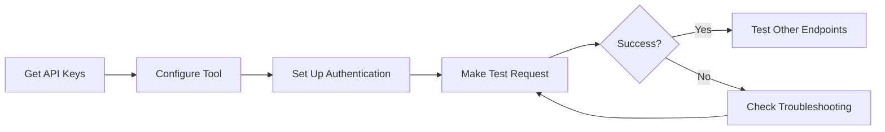

# API Testing Guide

Welcome to the BitXPay API testing documentation. This guide will help you quickly set up and test our merchant-facing APIs using various tools.

## Quick Start

Choose your preferred testing method:

- **[Postman Setup](/testing/postman-setup)** - Complete guide for Postman with DSA signature automation
- **[Other API Tools](/testing/api-testing-tools)** - Test with Insomnia, cURL, HTTPie, and more
- **[Troubleshooting](/testing/troubleshooting)** - Common issues and solutions

## Prerequisites

Before testing, you'll need:

1. **Merchant API Key** - Your unique API key (format: `bknn_xxxxxxxx`)
2. **Merchant Private Key** - DSA private key in PEM format
3. **API Testing Tool** - Postman, Insomnia, cURL, etc.

## Getting Your API Keys

### Sandbox Environment

For testing, use the sandbox environment:

**Base URL:** `https://sandboxapi.bitxpay.com/api/v1`

To obtain your sandbox credentials:

1. Log in to your [BitXPay Dashboard](https://dashboard.bitxpay.com)
2. Navigate to **Settings** → **API Keys**
3. Click **Generate Sandbox Keys**
4. Save both your **API Key** and **Private Key** securely

::: warning
Keep your private key secure! Never commit it to version control or share it publicly.
:::

### Production Environment

**Base URL:** `https://api.bitxpay.com/api/v1`

Production keys are available after account verification:

1. Complete KYB verification in the dashboard
2. Navigate to **Settings** → **API Keys** → **Production**
3. Generate and securely store your production keys

## Authentication Overview

BitXPay merchant APIs use **DSA signature authentication** for enhanced security:

1. Each request includes an API key, timestamp, and signature
2. The signature is generated using DSA with SHA-256
3. Signatures are valid for 5 minutes from the timestamp
4. DSA provides smaller signatures and faster signing compared to RSA

For detailed authentication information, see the [Authentication Reference](/api-reference/authentication).

## Testing Workflow

## Available Endpoints for Testing

### Payment Links API

- **Create Payment Link** - `POST /payments/links`
- **Get Payment Details** - `GET /payments/links/{payment_id}`
- **Update Payment Status** - `PATCH /payments/links/{id}`
- **List Payment Links** - `GET /payments/links`

See the [Payment Links API Reference](/api-reference/payments) for detailed endpoint documentation.

## Next Steps

1. **[Set up Postman](/testing/postman-setup)** - Recommended for beginners
2. **[Explore API endpoints](/api-reference/payments)** - Learn about available APIs
3. **[Review authentication](/api-reference/authentication)** - Understand security requirements

## Support

Need help with testing?

- **Email:** api-support@bitxpay.com
- **Documentation:** https://docs.bitxpay.com
- **Status Page:** https://status.bitxpay.com
