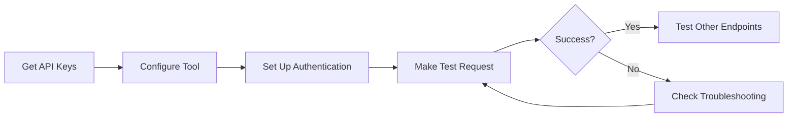

# API Testing Guide

Welcome to the BITXpay API testing documentation. This guide will help you quickly set up and test our merchant-facing APIs using various tools.

## Quick Start

Choose your preferred testing method:

- **[Postman Setup](/testing/postman-setup)** - Complete guide for Postman with Ed25519 signature automation
- **[Other API Tools](/testing/api-testing-tools)** - Test with Insomnia, cURL, HTTPie, and more
- **[Troubleshooting](/testing/troubleshooting)** - Common issues and solutions

## Prerequisites

Before testing, you'll need:

1. **Merchant API Key** - Your unique API key (format: `btxm_` + 12 hex characters, e.g. `btxm_9b451fa04a2e`)
2. **Merchant Private Key** - Ed25519 private key as issued: `Ed25519:<base64 PKCS#8 DER>`
3. **API Testing Tool** - Postman, Insomnia, cURL, etc.

## Getting Your API Keys

### Sandbox Environment

For testing, use the sandbox environment:

**Base URL:** `https://sandboxapi.bitxpay.com/api/v1`

To obtain your sandbox credentials:

1. Log in to your [BITXpay Dashboard](https://dashboard.bitxpay.com)
2. Navigate to **Settings** → **API Keys**
3. Click **Generate Sandbox Keys**
4. Save both your **API Key** and **Private Key** securely

::: warning
Keep your private key secure! Never commit it to version control or share it publicly.
:::

### Production Environment

**Base URL:** `{{ $api.production.baseUrl }}`

Production keys are available after account verification:

1. Complete KYB verification in the dashboard
2. Navigate to **Settings** → **API Keys** → **Production**
3. Generate and securely store your production keys

## Authentication Overview

BITXpay merchant APIs use **Ed25519 signature authentication** for enhanced security:

1. Each request includes an API key, timestamp, and signature
2. The signature is generated using Ed25519 (EdDSA) — no separate hash needed
3. Signatures are valid for 5 minutes from the timestamp
4. Ed25519 provides smaller signatures and faster signing compared to RSA

For detailed authentication information, see the [Authentication Reference](/api-reference/authentication).

## Testing Workflow

```mermaid
graph LR
    A[Get API Keys] --> B[Configure Tool]
    B --> C[Set Up Authentication]
    C --> D[Make Test Request]
    D --> E{Success?}
    E -->|Yes| F[Test Other Endpoints]
    E -->|No| G[Check Troubleshooting]
    G --> D
```

## Available Endpoints for Testing

### Payment Links API

- **List Payment Links** - `GET /payment_links`
- **Create Payment Link** - `POST /payment_links`
- **Get Payment Link by ID** - `GET /payment_links/{id}`
- **Delete Payment Link** - `DELETE /payment_links/{id}`

See the [Payment Links API Reference](/api-reference/payments) for detailed endpoint documentation.

## Next Steps

1. **[Set up Postman](/testing/postman-setup)** - Recommended for beginners
2. **[Explore API endpoints](/api-reference/payments)** - Learn about available APIs
3. **[Review authentication](/api-reference/authentication)** - Understand security requirements

## Support

Need help with testing?

- **Email:** {{ $site.urls.support.email }}
- **Documentation:** {{ $site.urls.support.documentation }}
<!-- - **Status Page:** {{ $site.urls.support.statusPage }} -->
